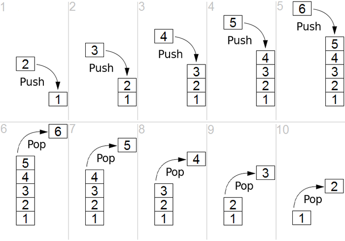

Pilha/Stack Representa uma pilha (como um baralho de cartas ou livros empilhados), seguindo o algoritmo LIFO. As quatro
operações principais são: push(e) - insere um elemento no topo; pop() - remove o elemento do topo; isEmpty() - informa
verdadeiro/falso se a pilha está vazia; peek() - acessa o elemento do topo (sem remover).

Essa estrutura é muito usada para representações de estado ou histórico de navegação, onde o mais recente está sempre no
topo.

```Java
class StackDemo {
    public static void main(String[] args) {
        Stack<String> history = new Stack<>();
        history.push("Algoritmos");
        history.push("Java");
        history.push("Estruturas de Dados");
        System.out.println("Topo: " + history.peek());
        String collect = String.join(", ", history);
        System.out.println("Todos: " + collect);
        System.out.println(history.pop());
        System.out.println(history.pop());
        System.out.println(history.pop());
    }
}
```



Complexidade Big O

Acessar: O(n)
Buscar: O(n)
Inserir: O(1)
Excluir: O(1)

# Código da pilha feito com array
